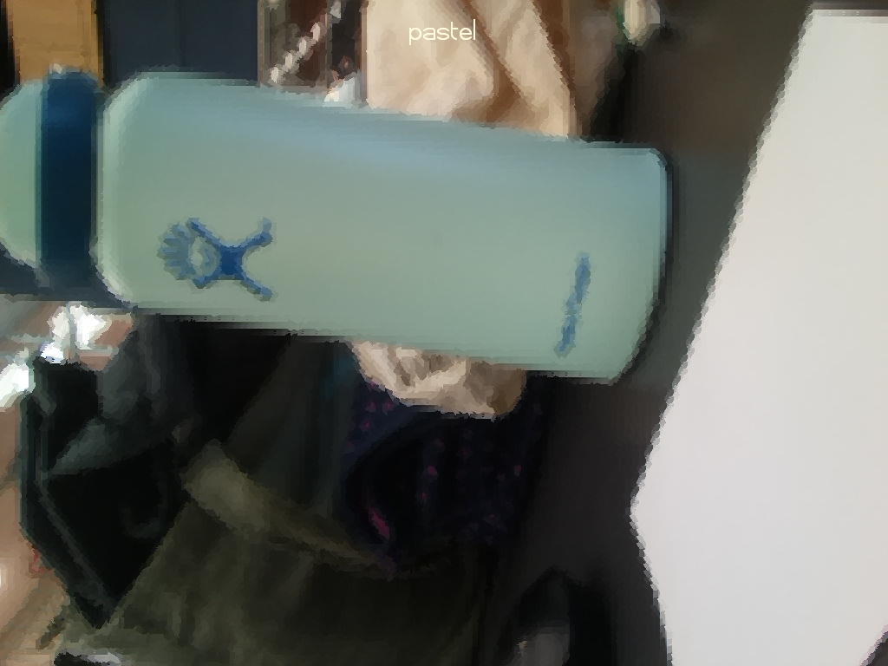
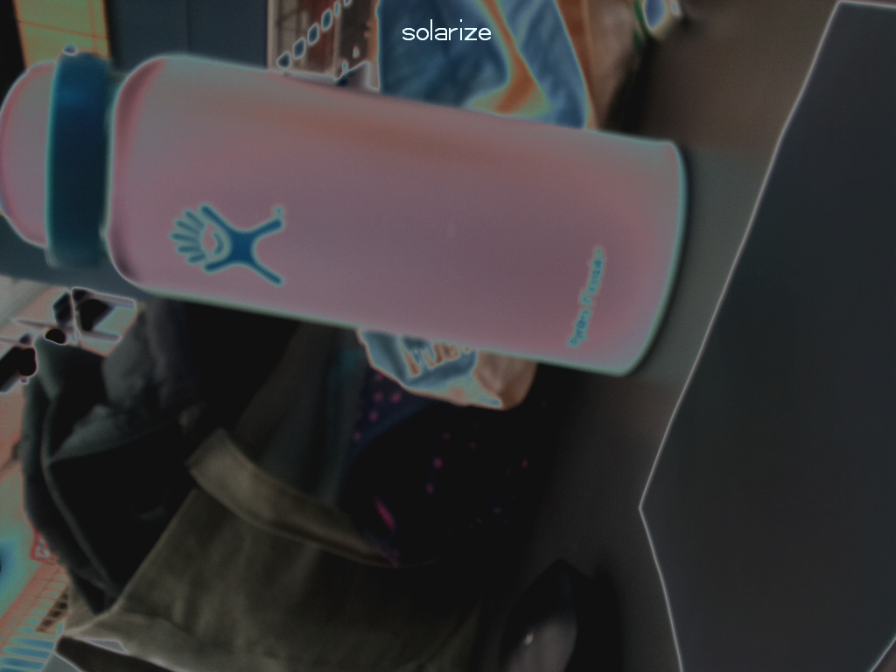
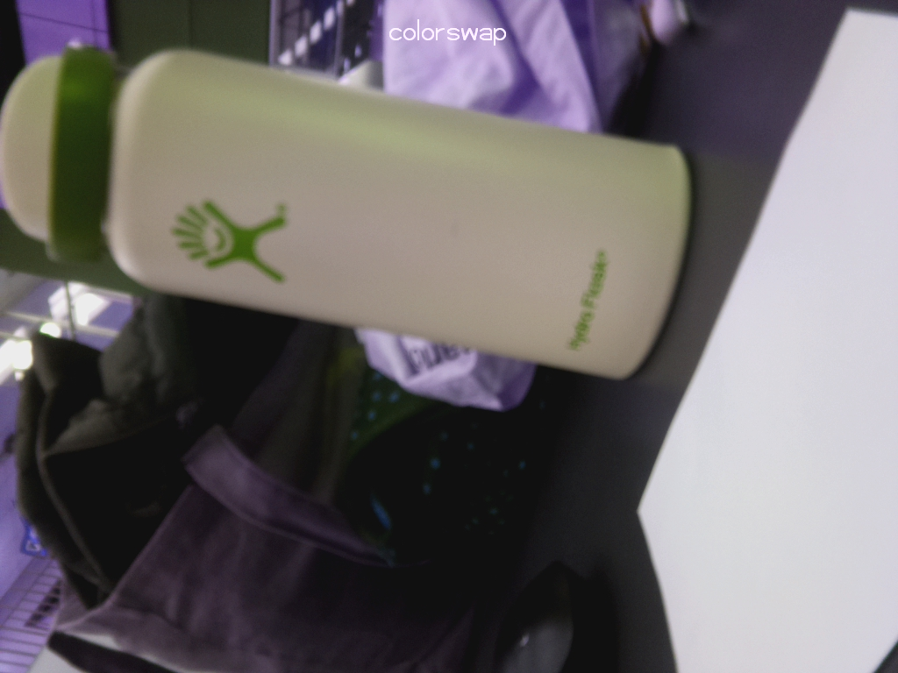
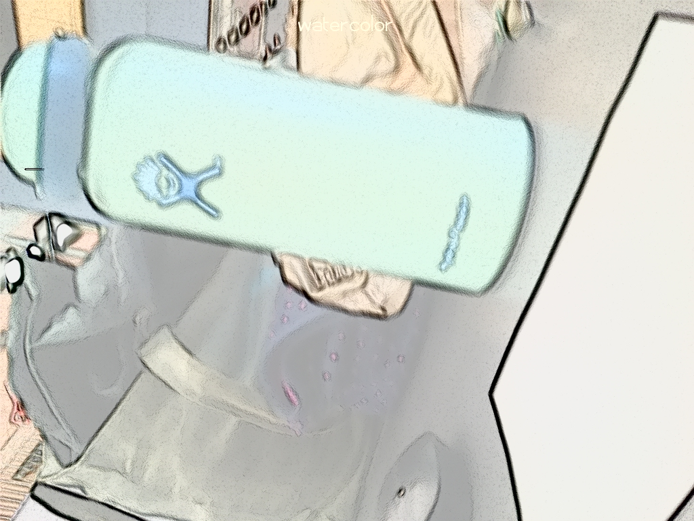
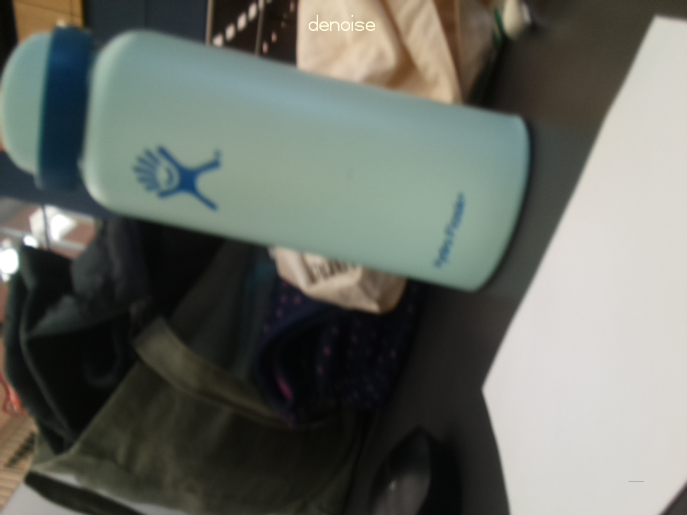
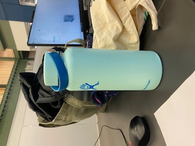

# Sigma Lab Vending Machine
Abigail Paquette

### SMART Goals
SMART goals made on November 27, 2021 for the rest of 2021 (until the start of winter break on December 18, 2021).

Goal #1:
|Criteria|My Goals|
|--------|--------|
|S: What do you want to do? Be Specific!|Figure out how to use the pi camera and analyze images it takes.|
|M: How will you measure your success?|I will consider this goal accomplished when I am able to take a picture with the pi camera and then have it output a piece of information about the image, say the number of pixels it contains above a certain grayscale value threshold.|
|A: Is it in your abilities to accomplish? What skills/resources do you still need?|I do think it is in my abilities to accomplish this, but I’ll need to be okay with looking things up. A big thing will be making sure to stay focused when I hit an obstacle and need to research new code. I have gotten the very basic camera code (taking a single picture when given a command), but I’ll need to learn a lot more about it, as well as how to access the image and then analyze it in Python.|
|R: How does this goal support the success of your project?|Being able to use the camera effectively and analyze images is a crucial piece of my project. This will allow me to start the actual algorithm that sorts pieces.|
|T: When exactly do you want to accomplish it?|I hope to have this done by Monday, December 6.|

Goal #2:
|Criteria|My Goals|
|--------|--------|
|S: What do you want to do? Be Specific!|Choose the four initial pieces of hardware I’ll be sorting and determine what characteristics from the images I’ll be using to differentiate between them. Determine the range of values for each piece.|
|M: How will you measure your success?|I will consider myself successful in this goal when I can run a program that successfully identifies each of the four pieces of hardware I am sorting.|
|A: Is it in your abilities to accomplish? What skills/resources do you still need?|I definitely don’t have the knowledge to do this yet, but I do know that it is completely possible and there’s tons of code out there. Additionally, last year and this year I’ve done some work with object recognition and image analysis using OpenCV and Vuforia through FTC.|
|R: How does this goal support the success of your project?|Figuring out the values for each piece will allow me to begin training the model, which is really the crux of the project.|
|T: When exactly do you want to accomplish it?|I hope to accomplish this before winter break, which would be Friday, December 17. However, I don’t know what that last week of school before break looks like, and an exam schedule could throw off my plans.|

### Engineering 4 Pi Camera Assignments
In order to get a better idea of how to use the Raspberry Pi camera and code for it, I decided to revisit the Engineering 4 Pi Camera assignments I hadn't ever done done. These were fairly quick, and they provided me with a strong foundation for using the camera that I think will be extremely useful. Up until now, I had only used command line actions with the camera, but for my project I'll definitely need to write code and program the camera, so this was a necessary step in the process. Additionally, the second assignment involved adding effects to images, which might be useful later down the road for turning images to grayscale to analyze. I also used arrays and for loops, which are both very useful comcepts that it was good to review.

[This link](https://picamera.readthedocs.io/en/release-1.10/index.html) was a very helpful resource for Pi Camera coding, and I will definitely use it later on. Section 4 had information on basic camera commands and section 10 had information about effects, as well as various other things you can specify, like turning the flash on or off.

[First Assignment](Camera/camera_test01.py) 

[Second Assignment](Camera/camera_test02.py)

  
  

